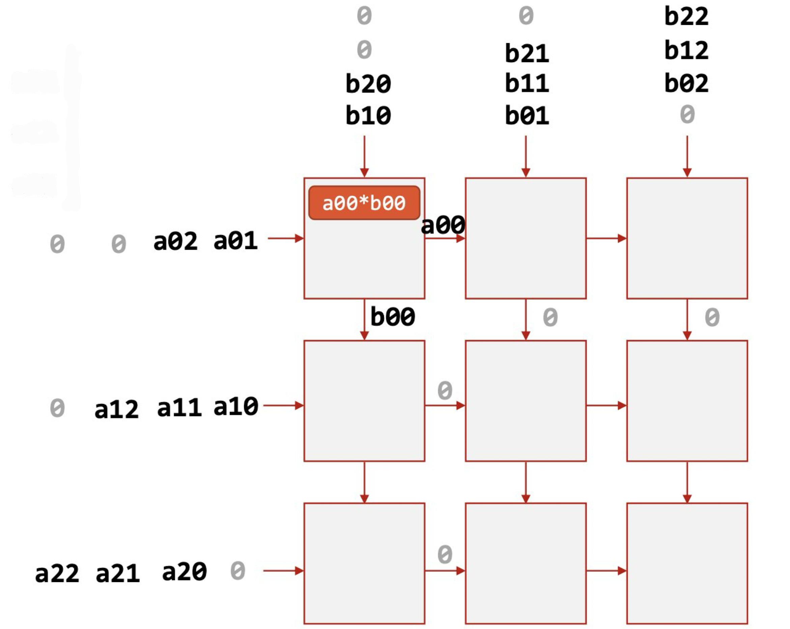
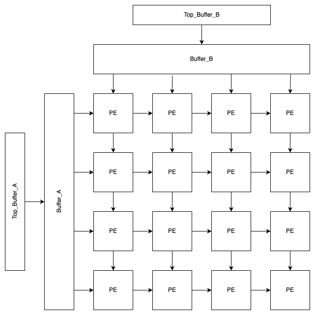
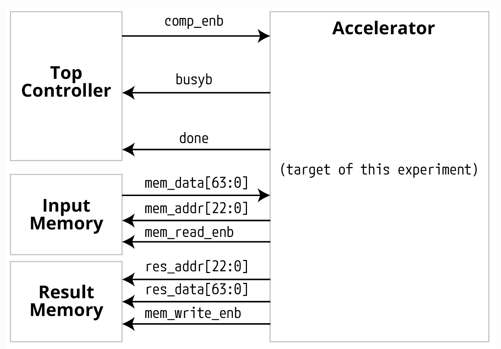
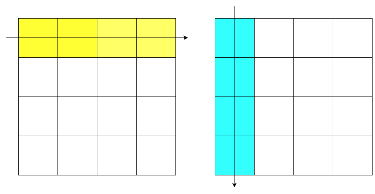
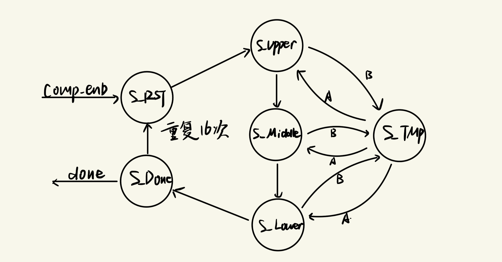
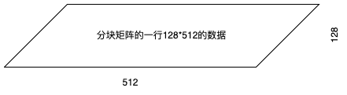
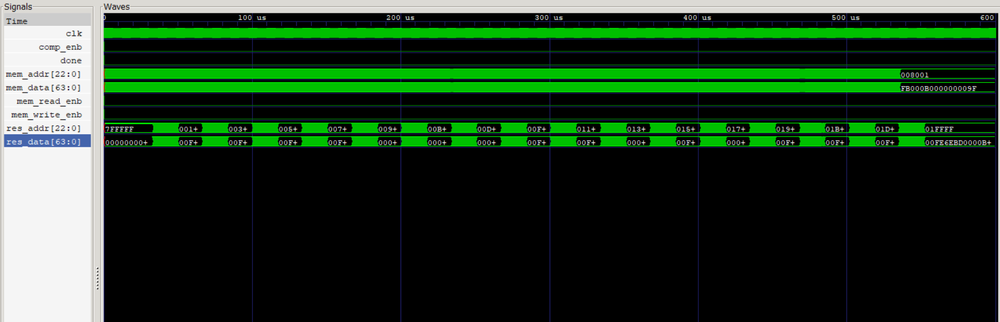

# My_sysAcc

This is the final project of "Principles and Design of Digital Systems(Honor Track)" , a course which is specially designed for students in Experimental Class of Electronic Information Science (E Class) 

## Design Objective

**Goal**: Implementation of a 512×512 matrix multiplication module. Specifically:
$$
\textbf{Z}=\textbf{X}\times \textbf{Y}
$$
Given matrices X and Y, compute the resultant matrix Z.

**Constraints**: For both input and output, the data bus width is limited to 64 bits.

**Data Specification**: This design implements all calculations using 24-bit integers to achieve absolute precision.

## Design Methodology

### Module Architecture

This project utilizes a 128×128 systolic array Processing Element (PE) computation module. The 512×512 matrix is partitioned into 16 blocks, employing block matrix multiplication to obtain the corresponding results. The systolic array adopts a parallelogram input method, multiplying 128×512 strip data units with corresponding computation units from the other matrix that have identical block partitioning.



#### Systolic Array



Above shows a simplified array design architecture.

- Top_Buffer_A & Top_Buffer_B: Components interfacing between the Accelerator and input_mem, comprising 8 data widths for storing 8 data elements read from external sources in a single operation.
- Buffer_A & Buffer_B: Load data from Top_Buffer into Buffer to accommodate systolic array width; once Buffer data is prepared, it is fed into the systolic array for computation.
- PE: Core computation unit that processes input data through multiplication and addition operations to generate corresponding results.

#### Internal-External Interaction

This design does not utilize SRAM, instead implementing data storage interaction directly within registers. While this approach incurs some time overhead due to repeated data reads, it reduces the computational area consumption to some extent.



The Accelerator module already encompasses the Systolic Array; once data enters the array and completes computation, the corresponding results can be output.

### Operating Principles

#### Block Matrix Multiplication



Matrix partitioning is employed to divide the matrix into blocks, achieving computation through data reuse. In block matrix operations, for the result block $Z_{ij}$, the calculation formula is:
$$
Z_{ij}=\sum_{k=1}^{4}X_{ik}\times Y_{kj}
$$
For each strip-shaped matrix block, its head address is:
$$
Address_{head}=i\times 2^{13}
$$
Here we assume that each address stores 8 data elements.

#### Accelerator

```verilog
module accelerator #(
    parameter integer INPUT_DATA_WIDTH  = 64,   // Input data width
    parameter integer INPUT_ADDR_WIDTH  = 23,   // Input address width
    parameter integer RESULT_DATA_WIDTH = 64,   // Output data width
    parameter integer RESULT_ADDR_WIDTH = 23,   // Output address width
    parameter integer MAC_SIZE = 128,           // Determines matrix size
    parameter integer BIG_MAC_SIZE = 512
) (
    input clk,                                  // Clock signal
    input comp_enb,  
    output [INPUT_ADDR_WIDTH-1:0] mem_addr,     // Memory address
    input [INPUT_DATA_WIDTH-1:0] mem_data,      // Memory data
    output mem_read_enb,                        // Memory read enable
    output mem_write_enb,                       // Memory write enable
    output [RESULT_ADDR_WIDTH-1:0] res_addr,    // Result address
    output [RESULT_DATA_WIDTH-1:0] res_data,    // Result data
    output busyb,                               // Busy signal
    output done                                 // Completion signal
);
```

Interface shown above.

#### Input Controller

```verilog
module In_controller#(
    parameter integer DATA_WIDTH = 64,          // Memory data width
    parameter integer ADDR_WIDTH = 23,          // Memory address width
    parameter integer BUFFER_DATA_WIDTH = 8,    // Internal buffer data width
    parameter integer TOP_BUFFER_RANGE = 8,     // Top buffer size
    parameter integer MAC_SIZE = 32,
    parameter integer B_ADDR_HEAD = 15,
    parameter integer BIG_MAC_SIZE  = 512
)(
    input clk, comp_enb,                        // Clock and enable signals
    input [DATA_WIDTH-1:0] data_in,             // External input data
    output reg done_in_enb,                     // Active low
    output wire [ADDR_WIDTH-1:0] mem_address,   // Memory address for input_mem interaction
    output reg mem_read_enb,                    // Memory read enable
    output reg copy_enb                         // Copy enable
);
output reg [BUFFER_DATA_WIDTH-1:0] buffer_A [0:MAC_SIZE-1];                // Matrix A buffer
output reg [BUFFER_DATA_WIDTH-1:0] buffer_B [0:MAC_SIZE-1];                // Matrix B buffer
```

Interface shown above.



The Input Controller primarily includes the Top_Buffer and Buffer components shown in the figure above. It receives data from Input-mem and outputs one row of elements for matrices A and B respectively. During entry into the systolic array, the matrix is shaped into a parallelogram form.



The remaining areas are zero-padded to form a rectangular input unit. We designate the two computation matrices as **A** and **B**.

- **S_RST**: Initializes the input module, resets various control signals, and begins receiving information. We specify receiving matrix A's information first, followed by matrix B's.
- **S_UPPER**: Processes the upper triangular matrix in the parallelogram through controlled zero-padding.
- **S_Middle**: Processes middle strip data; no zero-padding required, direct input once sufficient data is obtained.
- **S_Lower**: Processes the final lower triangular matrix, still implemented through controlled zero-padding.

In the above states, data reception only includes matrix A's reception. Matrix B is processed through a separate S_TMP state.

- **S_TMP**: Receives and stores matrix B data.
- **S_DONE**: Comprises two states:
  - S_DONE_1: Indicates current matrix input iteration and completes state transitions through col_B and row_A variables. Also implements a wait state allowing input systolic array data to fully flow through and obtain computation results.
  - S_DONE_2: Modifies matrix A and B data address headers enabling subsequent matrix data reads.

Upon completing all calculations, the matrix outputs a DONE signal and remains in S_DONE until a new comp_enb signal initiates the next matrix computation.

#### Output Controller

```verilog
module Out_controller #(
    parameter integer DATA_IN_WIDTH = 24,
    parameter integer ADDR_IN_WIDTH = 18,
    parameter integer DATA_OUT_WIDTH = 64,
    parameter integer ADDR_OUT_WIDTH = 23,
    parameter integer MAC_SIZE = 128
)(
    input clk, comp_enb,
    input [DATA_IN_WIDTH-1:0] pe_result [0:MAC_SIZE-1][0:MAC_SIZE-1],
    input done_out [0:MAC_SIZE-1][0:MAC_SIZE-1],
    input done_finish,
    output reg mem_write_enb,
    output reg busyb,
    output reg done,
    output reg [ADDR_OUT_WIDTH-1:0] res_out_addr,
    output reg [DATA_OUT_WIDTH-1:0] res_data
); 
```

Interface shown above.

In the output process, since the output width is 64 bits while our intermediate calculation results are int24, each output address stores 2 data elements, with 8 padding bits added before calculation results to represent meaningless data bits (Note: This is not converting to int32; in Python result conversion, only 24 bits are used). The output process involves first storing calculation results in a 128×128 register array, then outputting them row by row.

#### Processing Element (PE)

```verilog
module PE #(
    parameter integer DATA_WIDTH = 24,
    parameter integer BUFFER_DATA_WIDTH = 8,
    parameter integer MAC_SIZE = 512
)(
    input clk,
    input signed [BUFFER_DATA_WIDTH-1:0] up,
    input signed [BUFFER_DATA_WIDTH-1:0] left,
    input enable_b,
    input comp_enb,
    input reset_b,
    output reg signed [BUFFER_DATA_WIDTH-1:0] right,
    output reg signed [BUFFER_DATA_WIDTH-1:0] down,
    output reg signed [DATA_WIDTH-1:0] out_data
);
```

In the PE module, we utilize Verilog's built-in `signed` data type for signed operations rather than implementing a specialized multiplier.

## Experimental Results

### Simulation Results



Above shows the Accelerator output interface waveform. Input processing continues throughout, with 16 collective outputs. Since output takes less time than input, designing features like FIFO to fully utilize output width is not necessary. The simulation waveform shows that under 1ns/1ns timing specifications, computation time is 552032ns, or 276016 clock cycles. Setting the clock period to 1ns yields a computation time of 276016ns, approximately 0.276ms, which is about 720 times faster than Python's 0.2s computation time.

### Synthesis Results

Due to lengthy synthesis times, we synthesized an 8×8 Systolic Array to obtain computation results:

| Total Area           | Power (W) |
| -------------------- | --------- |
| $3.847\times 10^{6}$ | 8.85      |

Using int24 for calculations eliminates errors, resulting in both relative and absolute errors of 0.
